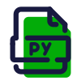

#  dev_python  

### Repositório criado para compilar meus estudos em Python

#### O que você encontrará por aqui:

- Sistema Bancário (link)
- Calculadora 
- Calculadora IMC 
- Calculadora Tinta
- API com Flask
- App de Previsão do tempo
- criar readmes de como usar local em cada pasta

<!-- >texto

# 
 -->
